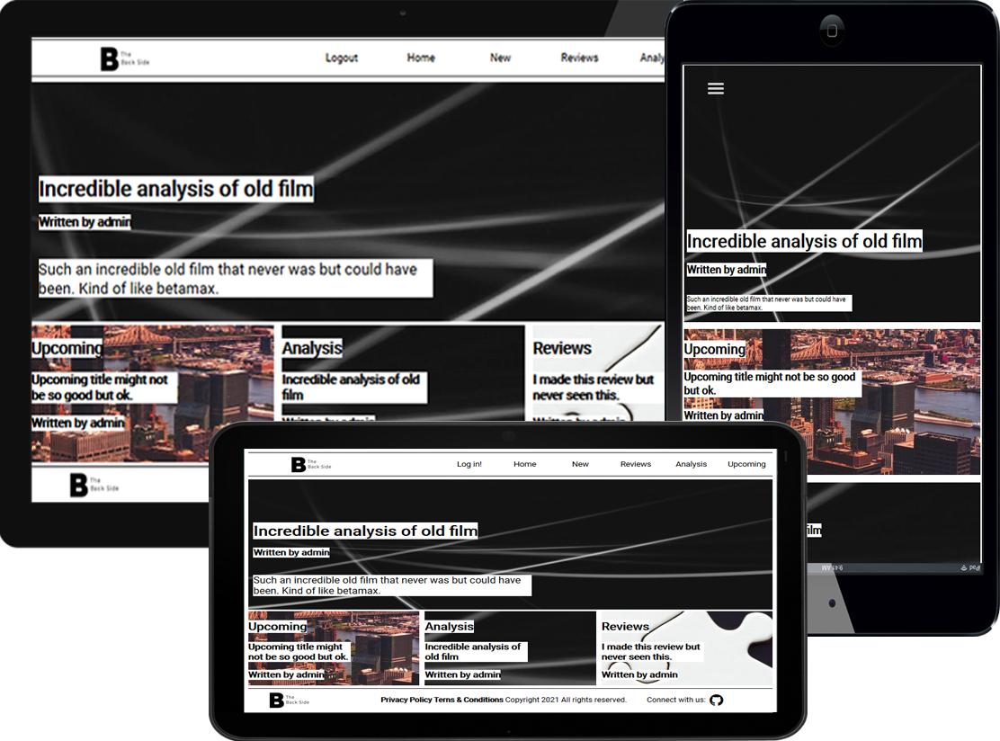

[![Contributors][contributors-shield]][contributors-url]
[![Issues][issues-shield]][issues-url]
<br />
<p align="center">
  
  <h2 align="center"> Articles project </h2>
  <p align="center">
  	 Web app that lets you create articles (RoR ♦️)
    <br />
    <a href="https://github.com/Fig77/Ruby-on-Rails-Article-web"><strong>Explore the docs »</strong></a>
    <br />
</p>

# Ruby on Rails Articles project

This project emulates an article posting/sharing website. Functions implemented are constraint to register, login, post new articles, read them, and vote for them.

Index
=====
   * [Built Wit](#built-with)
   * [Installation](#installation)
     - [Prerequisites](#prerequisites)
   * [Usage](#usage)
      - [Screenshots](#screenshots)
      - [Live](#live)
   * [Testing](#testing)
   * [Credits](#credits)
   * [Contributing](#contributing)

## Built With

- Ruby v2.6.5
- Ruby on Rails v5.2.4
- Webpack
- SASS (for grid structure)
- HTML/CSS

## Installation

### Prerequisites

Ruby: 2.6.3
Rails: 5.2.3
Postgres: >=9.5

---

```
bundle install
```
Setup database with:

```
   rails db:create
   rails db:migrate
```

## Usage

Start server with:

```
    rails server
```

Open `http://localhost:3000/` in your browser.

Open `https://immense-plains-60294.herokuapp.com/` in your browser.

## Live Demo

`https://vast-inlet-50954.herokuapp.com/`

## Testing

Unit test was used on this project for testing models and controllers
RSpec was used for testing login - account creation - article creation and 
vote action.

```
    run rails test for testing on console
    run rails test -v to see verbose version (showing what is testing)
    run bundle exec rspec for running integration test written on RSpec
    run bundle exec rspec spec --format documentation to read the test that will
    be running for rspec.

    Small article creation integration test was also written in unit-test
```
**Read below if a test error showed !**

### Bugs you may find !

Anything weird happening somewhere that you wish to report it, please do while stating
how to replicate this bug, what did you tried to do and what message (if any) did appear.
Thank you ! :green_heart: :green_heart:

## Authors

Facundo Iglesias: `https://github.com/Fig77`

## 🤝 Contributing

Contributions, issues and feature requests are welcome!

Feel free to check the [issues page](issues/).

## License
[MIT](https://choosealicense.com/licenses/mit/)

<!-- MARKDOWN LINKS & IMAGES -->
<!-- https://www.markdownguide.org/basic-syntax/#reference-style-links -->
[contributors-shield]: https://img.shields.io/badge/Contributors-1-brightgreen
[contributors-url]: https://github.com/Fig77/Gradients-Project/graphs/contributors
[issues-shield]: https://img.shields.io/badge/issues-0-%2300ff00
[issues-url]: https://github.com/Fig77/Template/issues
[product-screenshot]: assets/menu.png
